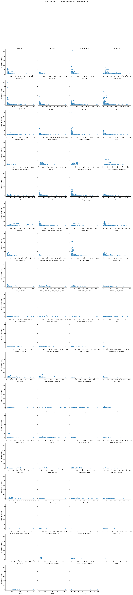

# Product-Recommendation-systems-based-on-Customer-Behaviour
This project builds an AI-driven recommendation system using customer browsing and purchase history to provide personalized product suggestions. It aims to enhance customer engagement and boost sales by delivering tailored recommendations based on user behaviour.

## 1. Introduction
This project develops an **AI-driven product recommendation system** using **collaborative filtering techniques** to analyze **customer browsing and purchase history**. By leveraging **user behavior and product similarity**, the system suggests relevant products, improving customer experience and increasing sales for **Trafilea**.

## 2. Background
E-commerce businesses thrive on **personalized recommendations** to enhance customer engagement and boost conversions. This project aims to:
- Optimize product discovery by recommending items based on **user preferences**.
- Improve cross-selling opportunities by identifying **complementary products**.
- Leverage AI techniques to provide **highly relevant** recommendations.

## 3. Data Collection and Processing
### **Data Sources**
The dataset consists of:
- **orders.csv** → Tracks customer purchases.
- **order_items.csv** → Links customers with purchased products.
- **customers.csv** → Associates orders with customers.
- **products.csv** → Contains product details.
- **product_category_name_translation.csv** → Translates product categories.

### **Data Preprocessing Steps**
- Handling missing values and outliers.
- Converting timestamps to `datetime` format.
- Normalizing numerical values (e.g., price, weight, dimensions).
- Encoding categorical features for model training.
- Creating a **user-item interaction matrix** for recommendation modeling.

## 4. Exploratory Data Analysis (EDA)
Key insights derived from EDA:
- **Most frequently purchased products**.
- **Top-selling product categories**.
- **User purchase frequency distribution**.
- **Co-purchased product analysis** (Which products are often bought together).

### **Visuals:**
- 
- 
- 
- 
- 
- 
- 
- 
- 
- 

## 5. Methodology
### **Recommendation Approaches**
#### **1. User-Based Collaborative Filtering**
- Identifies users with similar purchase histories.
- Recommends products that similar users have purchased.
- **Best for:** Personalized recommendations.

#### **2. Item-Based Collaborative Filtering**
- Finds similar products based on purchase patterns.
- Recommends products frequently bought together.
- **Best for:** Cross-selling and related product suggestions.

#### **3. Hybrid Recommendation System**
- Combines user-based and item-based approaches.
- Generates recommendations considering **both user preference and product similarity**.
- **Best for:** Improving diversity in recommendations.

## 6. Results
- **User-based filtering** provided highly **personalized** recommendations.
- **Item-based filtering** effectively suggested **complementary products**.
- The **hybrid approach** delivered the most balanced recommendations.
- **Cold-start problem** (new users/products) was mitigated using **popularity-based recommendations**.

## 7. Recommendations
- **Personalized Promotions:** Tailor marketing campaigns based on recommendation trends.
- **Real-time Recommendations:** Deploy AI models to update suggestions dynamically.
- **Bundle Offers:** Suggest frequently co-purchased products as discount bundles.
- **Cold-Start Solutions:** Introduce trending/popular products for new users.

## 8. Future Work
- **Deep Learning-Based Recommenders** → Implementing **Neural Collaborative Filtering** and **Transformer models**.
- **Context-Aware Recommendations** → Factoring in seasonality, location, and user intent.
- **A/B Testing** → Evaluating recommendation impact on **customer engagement**.
- **Multilingual Support** → Expanding product recommendations for non-English users.

## 9. Conclusion
This **AI-powered recommendation system** for **Trafilea** improves product discovery and enhances customer experience. By integrating **collaborative filtering** and **hybrid modeling**, the system ensures **highly relevant and diverse** product recommendations, ultimately boosting e-commerce sales.

