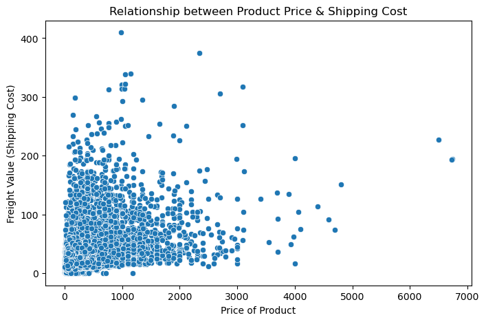
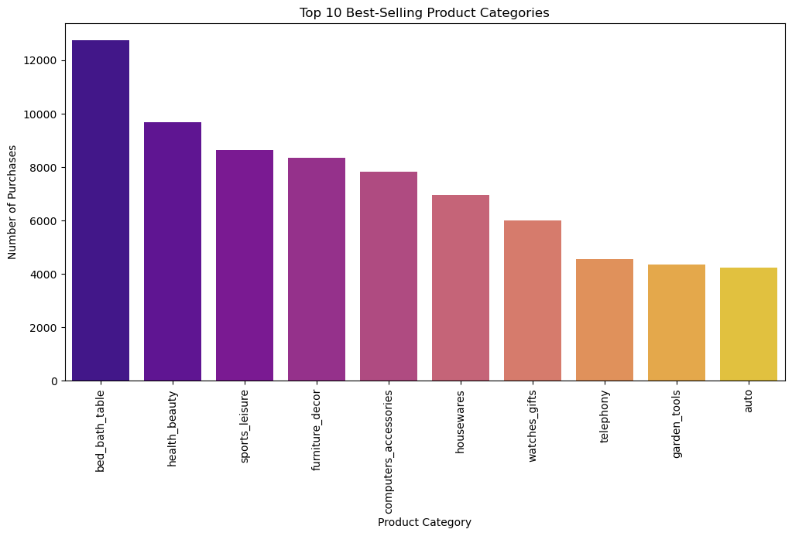
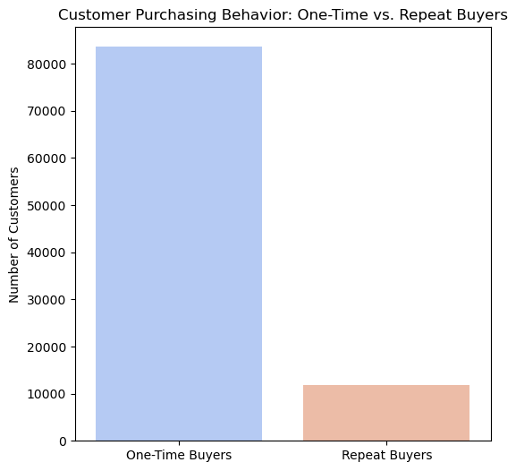
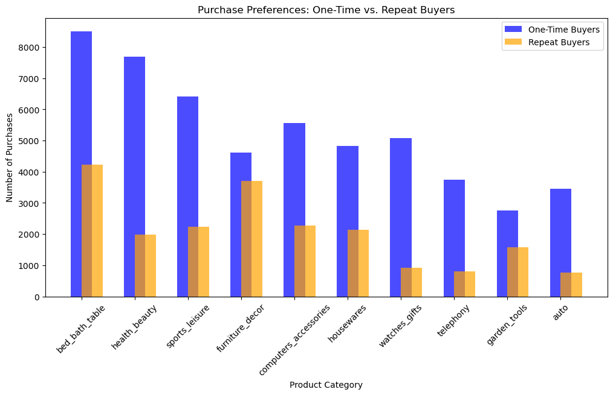
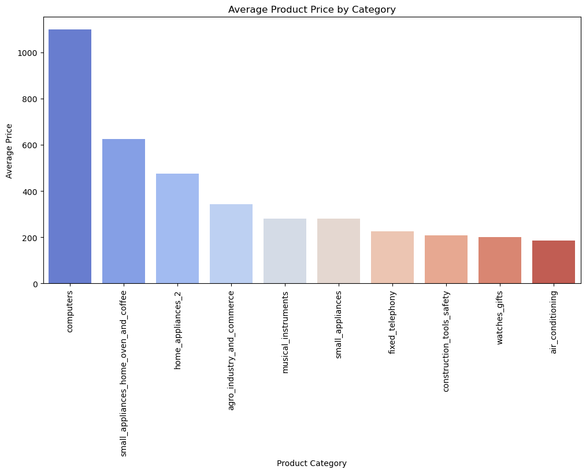
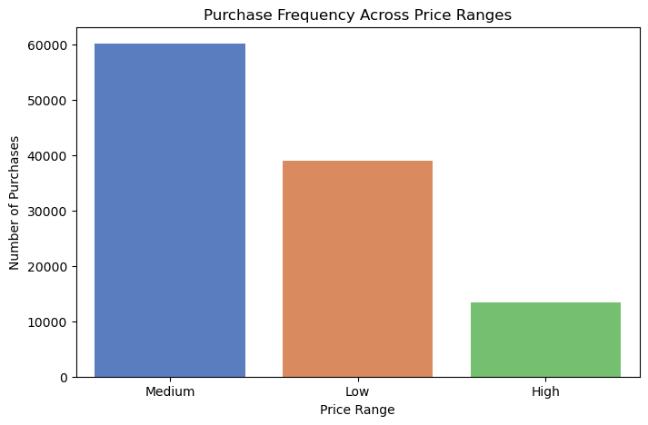
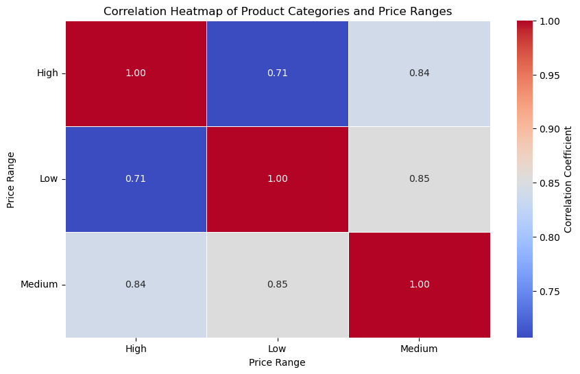

# Product-Recommendation-systems-based-on-Customer-Behaviour
This project builds an AI-driven recommendation system using customer browsing and purchase history to provide personalized product suggestions. It aims to enhance customer engagement and boost sales by delivering tailored recommendations based on user behaviour.

  
## 1. Introduction
In the rapidly evolving landscape of e-commerce, **personalized recommendations** are fundamental to enhancing customer engagement and increasing sales. This project develops an **AI-driven product recommendation system** using **collaborative filtering techniques** to analyze **customer browsing and purchase history**. By leveraging **user behavior and product similarity**, the system suggests highly relevant products, improving customer experience and driving revenue growth for **Trafilea**.

## 2. Background
The exponential growth of online shopping has led to an overwhelming number of product choices for customers. Effective recommendation systems help mitigate decision fatigue by guiding customers toward products aligned with their preferences. **Trafilea**, as a leading tech-commerce company, requires a sophisticated recommendation engine to:
- **Enhance product discovery** by recommending items based on browsing and purchase behavior.
- **Increase cross-selling and upselling** through intelligent product pairing.
- **Leverage AI-powered techniques** to personalize customer experiences at scale.
- **Improve customer retention** by offering relevant recommendations tailored to each user.

This project focuses on developing an AI-driven recommendation system that not only enhances customer satisfaction but also optimizes business revenue by predicting and recommending products with high conversion potential.

## 3. Data Collection and Processing
### **Data Sources**
The dataset consists of:
- **orders.csv** → Tracks customer purchases.
- **order_items.csv** → Links customers with purchased products.
- **customers.csv** → Associates orders with customers.
- **products.csv** → Contains product details.
- **product_category_name_translation.csv** → Translates product categories.

### **Data Preprocessing Steps**
- Handling missing values and outliers.
- Converting timestamps to `datetime` format.
- Normalizing numerical values (e.g., price, weight, dimensions).
- Encoding categorical features for model training.
- Creating a **user-item interaction matrix** for recommendation modeling.

## 4. Exploratory Data Analysis (EDA)
### Price and Product Dimension Distribution

The analysis reveals that product **prices**, **weights**, and **dimensions** exhibit significant outliers. This indicates the need for data normalization to ensure fair model training and prevent skewed recommendations.

### Relationship Between Price and Shipping Cost

There is a positive correlation between **product price** and **shipping cost**, but high variance exists, indicating that **shipping fees do not scale proportionally** for all products.

### Best-Selling Product Categories

The most frequently purchased product categories are:
- **bed_bath_table**
- **health_beauty**
- **sports_leisure**
- **furniture_decor**
These categories represent a high proportion of customer demand, making them prime targets for personalized recommendations.

### Customer Purchasing Behavior

The majority of customers are **one-time buyers**, while only a small fraction makes repeat purchases. This suggests that personalized recommendations could help **increase customer retention**.

### One-Time vs. Repeat Buyers

Repeat buyers tend to purchase from specific categories more frequently than one-time buyers, indicating the **potential for loyalty-driven recommendations**.

### Purchase Preferences Across Categories

Certain categories like **health_beauty** and **furniture_decor** attract repeat buyers more than others. This insight can be used to design **personalized retention strategies**.

### Average Price by Category

The highest-priced categories include **computers** and **home_appliances**, indicating that high-value items might require **different recommendation strategies** compared to lower-cost, high-frequency purchases.

### Purchase Frequency Across Price Ranges

Medium-priced products dominate purchases, while high-priced products see lower volume. This suggests that customers may need **more incentives** (discounts, financing options) to purchase expensive products.

### Correlation Between Product Categories and Prices

The heatmap reveals **strong correlations** between **product category** and **price range**, which can be leveraged for more targeted recommendations.

## 5. Methodology
### **Recommendation Approaches**
#### **1. User-Based Collaborative Filtering**
- Identifies users with similar purchase histories.
- Recommends products that similar users have purchased.
- **Best for:** Personalized recommendations.

#### **2. Item-Based Collaborative Filtering**
- Finds similar products based on purchase patterns.
- Recommends products frequently bought together.
- **Best for:** Cross-selling and related product suggestions.

#### **3. Hybrid Recommendation System**
- Combines user-based and item-based approaches.
- Generates recommendations considering **both user preference and product similarity**.
- **Best for:** Improving diversity in recommendations.

## 6. Results
- **User-based filtering** provided highly **personalized** recommendations.
- **Item-based filtering** effectively suggested **complementary products**.
- The **hybrid approach** delivered the most balanced recommendations.
- **Cold-start problem** (new users/products) was mitigated using **popularity-based recommendations**.

## 7. Recommendations
- **Personalized Promotions:** Tailor marketing campaigns based on recommendation trends.
- **Real-time Recommendations:** Deploy AI models to update suggestions dynamically.
- **Bundle Offers:** Suggest frequently co-purchased products as discount bundles.
- **Cold-Start Solutions:** Introduce trending/popular products for new users.

## 8. Future Work
- **Deep Learning-Based Recommenders** → Implementing **Neural Collaborative Filtering** and **Transformer models**.
- **Context-Aware Recommendations** → Factoring in seasonality, location, and user intent.
- **A/B Testing** → Evaluating recommendation impact on **customer engagement**.
- **Multilingual Support** → Expanding product recommendations for non-English users.

## 9. Conclusion
This **AI-powered recommendation system** for **Trafilea** improves product discovery and enhances customer experience. By integrating **collaborative filtering** and **hybrid modeling**, the system ensures **highly relevant and diverse** product recommendations, ultimately boosting e-commerce sales.

