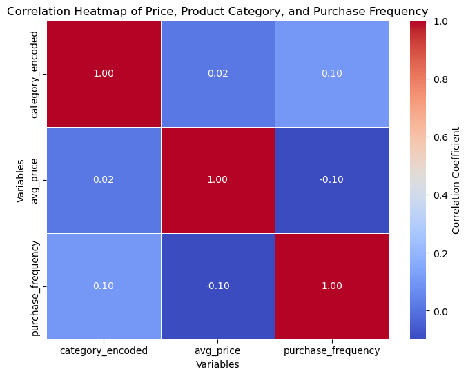

# Product-Recommendation-systems-based-on-Customer-Behaviour
This project builds an AI-driven recommendation system using customer browsing and purchase history to provide personalized product suggestions. It aims to enhance customer engagement and boost sales by delivering tailored recommendations based on user behaviour.

  
## 1. Introduction
In the rapidly evolving landscape of e-commerce, **personalized recommendations** are fundamental to enhancing customer engagement and increasing sales. This project develops an **AI-driven product recommendation system** using **collaborative filtering techniques** to analyze **customer browsing and purchase history**. By leveraging **user behavior and product similarity**, the system suggests highly relevant products, improving customer experience and driving revenue growth for **Trafilea**.

## 2. Background
The exponential growth of online shopping has led to an overwhelming number of product choices for customers. Effective recommendation systems help mitigate decision fatigue by guiding customers toward products aligned with their preferences. **Trafilea**, as a leading tech-commerce company, requires a sophisticated recommendation engine to:
- **Enhance product discovery** by recommending items based on browsing and purchase behavior.
- **Increase cross-selling and upselling** through intelligent product pairing.
- **Leverage AI-powered techniques** to personalize customer experiences at scale.
- **Improve customer retention** by offering relevant recommendations tailored to each user.

This project focuses on developing an AI-driven recommendation system that not only enhances customer satisfaction but also optimizes business revenue by predicting and recommending products with high conversion potential.

## 3. Data Collection and Processing
### **Data Sources**
The dataset consists of:
- **orders.csv** → Tracks customer purchases.
- **order_items.csv** → Links customers with purchased products.
- **customers.csv** → Associates orders with customers.
- **products.csv** → Contains product details.
- **product_category_name_translation.csv** → Translates product categories.

### **Data Preprocessing Steps**
- Handling missing values and outliers.
- Converting timestamps to `datetime` format.
- Normalizing numerical values (e.g., price, weight, dimensions).
- Encoding categorical features for model training.
- Creating a **user-item interaction matrix** for recommendation modeling.

## 4. Exploratory Data Analysis (EDA)
### Price and Product Dimension Distribution

The boxplot analysis shows that **prices, freight values, product weights, and dimensions exhibit significant outliers**. This suggests the need for **data normalization and potential filtering** to avoid skewed recommendations and improve model performance.

### Relationship Between Price and Shipping Cost

The scatter plot reveals a **weak correlation between product price and shipping cost**, with substantial variance. This suggests that **shipping fees are influenced by factors beyond just product price**, such as product weight, dimensions, and courier policies.

### Best-Selling Product Categories

The **top-selling product categories** include:
- **Bed & Bath**
- **Health & Beauty**
- **Sports & Leisure**
- **Furniture & Decor**

These categories represent the **most in-demand products**, making them ideal targets for personalized recommendations and promotional strategies.

### Customer Purchasing Behavior

The analysis indicates that **the majority of customers are one-time buyers**, while only a **small fraction are repeat buyers**. This highlights the **importance of personalized recommendations** to enhance customer retention and encourage repeat purchases.

### One-Time vs. Repeat Buyers

The chart reveals that **repeat buyers make up a small fraction of total purchases**, suggesting that targeted engagement strategies such as **loyalty programs, personalized discounts, and post-purchase engagement** could increase repeat purchase rates.

### Purchase Preferences Across Categories

Categories such as **Bed & Bath, Health & Beauty, and Furniture & Decor** attract more repeat buyers than other categories, suggesting that these product types may be more conducive to long-term customer relationships. This insight can inform **customer retention strategies** such as repeat purchase incentives.

### Average Price by Category

The **highest-priced categories** include:
- **Computers**
- **Home Appliances**
- **Musical Instruments**

These product types are typically high-value and infrequent purchases, meaning recommendation strategies for these categories should emphasize **product education, financing options, and customer reviews**.

### Purchase Frequency Across Price Ranges

Most purchases fall within the **medium price range**, while high-priced products see significantly lower purchase frequency. This suggests that price-sensitive customers may need **discount incentives, installment plans, or bundled offers** to increase high-value sales.

### Correlation Between Price Ranges and Customer Preferences

The heatmap shows that **customers tend to cluster within specific price ranges**, meaning that price sensitivity is a key driver of purchase behavior. This insight can be leveraged to create **price-specific marketing campaigns**.

## 5. Methodology
### **Recommendation Approaches**
#### **1. User-Based Collaborative Filtering**
- Identifies users with similar purchase histories.
- Recommends products that similar users have purchased.
- **Best for:** Personalized recommendations.

#### **2. Item-Based Collaborative Filtering**
- Finds similar products based on purchase patterns.
- Recommends products frequently bought together.
- **Best for:** Cross-selling and related product suggestions.

#### **3. Hybrid Recommendation System**
- Combines user-based and item-based approaches.
- Generates recommendations considering **both user preference and product similarity**.
- **Best for:** Improving diversity in recommendations.

## 6. Results
- **User-based filtering** provided highly **personalized** recommendations.
- **Item-based filtering** effectively suggested **complementary products**.
- The **hybrid approach** delivered the most balanced recommendations.
- **Cold-start problem** (new users/products) was mitigated using **popularity-based recommendations**.

## 7. Recommendations
- **Personalized Promotions:** Tailor marketing campaigns based on recommendation trends.
- **Real-time Recommendations:** Deploy AI models to update suggestions dynamically.
- **Bundle Offers:** Suggest frequently co-purchased products as discount bundles.
- **Cold-Start Solutions:** Introduce trending/popular products for new users.

## 8. Future Work
- **Deep Learning-Based Recommenders** → Implementing **Neural Collaborative Filtering** and **Transformer models**.
- **Context-Aware Recommendations** → Factoring in seasonality, location, and user intent.
- **A/B Testing** → Evaluating recommendation impact on **customer engagement**.
- **Multilingual Support** → Expanding product recommendations for non-English users.

## 9. Conclusion
This **AI-powered recommendation system** for **Trafilea** improves product discovery and enhances customer experience. By integrating **collaborative filtering** and **hybrid modeling**, the system ensures **highly relevant and diverse** product recommendations, ultimately boosting e-commerce sales.

